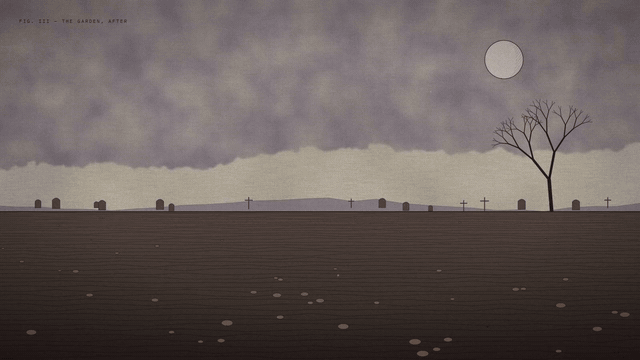
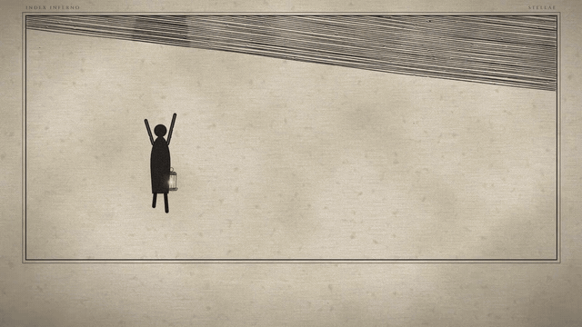

# code-to-cinema · 代码映画

**全程用代码画出来的短片。没有用任何生图 / 生视频模型。**
每一根线、每一点光、每一粒颗粒都是手写（准确说是 agent 写）的 SVG，一帧一帧显影，在无头浏览器里渲染；配乐也是纯 JavaScript 现场合成的，最后用 ffmpeg 出片。

**Short films drawn entirely in code. No image or video models were used.**
Every line, glow and grain is hand-written SVG (well, agent-written), revealed pose by pose and rendered in headless Chromium. The score is synthesised in plain JavaScript, and ffmpeg encodes the result.

| 37号觉醒 Awakening | 铜版画 Engraving | 掐丝珐琅 Liyue |
|---|---|---|
|  |  |  |
| 1920 年代定格动画胶片：象牙纸上的铅笔与水彩，每秒 8 个跳动的姿势，标本标签、纸片字卡、唯一一抹酒红，最后一记砸屏大标题。 | 多雷式铜版画：棕褐纸面、交叉排线一层层堆出阴影、笔尖跟着最新一笔走，只有一种暖色灯光。 | 月夜粉彩掐丝珐琅：金丝自己盘出轮廓，珐琅釉一格格流满，然后发光。古筝配乐。 |
| 1920s stop-motion reel: pencil and wash on ivory paper, poses that jump 8 times a second, specimen labels, paper caption cards, one wine red, a slam title. | Doré-style copperplate: sepia paper, cross-hatching that builds the shadows, a pen nib that follows the newest stroke, one warm lamp colour. | Pastel cloisonné at night: gold wire lays itself, enamel floods each cell, then it glows. Guzheng score. |
| *AWAKENING* | *INDEX INFERNO* | *千里共婵娟* |

## 里面有什么 · What's inside

- `engine/`：构建器、渲染器（Playwright + Chromium）、编码器，每种画风一个“抽屉”（`engine/<style>/`，各自带 `head.html`、`lib.js`、`main.js`、`audio.cjs`）。
  The builder, the renderer, the encoder, and one drawer per style.
- `styles/*.md`：每种画风一份指南，含色板、工具函数、动作词汇、音效事件和参考分镜。
  One guide per style: palette, helpers, motion vocabulary, sound events and a reference shot list.
- `SKILL.md`：完整流程（剧本 → 分镜 → 审图 → 渲染 → 配乐 → 出片）。它写成了 agent skill，可以把整个文件夹放进 Claude Code（或任何读 skill 的 agent），然后直接说“做一个短片”。
  The full workflow, written as an agent skill. Drop the folder into Claude Code (or any agent that reads skills) and ask for a film.
- `examples/moonrise`：一分钟跑通的小样，用来验证环境。
  A tiny demo that proves your setup works in about a minute.
- `examples/typewriter`：觉醒画风的 8 秒小样（一台没人碰的打字机自己写完了一页），新片可以从它起步。
  An 8-second demo of the awakening style (a typewriter that types by itself); a starting point for your own film.

## 快速开始 · Quick start

```bash
npm i playwright && npx playwright install chromium
# ffmpeg 需要在 PATH 里，或者设置 FFMPEG=/path/to/ffmpeg

node engine/build.cjs  examples/moonrise
node engine/render.cjs examples/moonrise all
node engine/render.cjs examples/moonrise timeline
node engine/audio.cjs  examples/moonrise
node engine/encode.cjs examples/moonrise          # → examples/moonrise/film.mp4
```

跑觉醒画风小样 · Render the awakening demo:

```bash
node engine/build.cjs            examples/typewriter
node engine/render.cjs           examples/typewriter all
node engine/render.cjs           examples/typewriter timeline
node engine/awakening/audio.cjs  examples/typewriter
node engine/encode.cjs           examples/typewriter
```

做新片：先读 `SKILL.md`，再读你想要的画风指南。在 `FILM` 里写 `style: 'awakening'` 或 `style: 'liyue'`；不写就是铜版画。
For a new film, read `SKILL.md` and then the guide for your style. Set `style: 'awakening'` or `style: 'liyue'` in `FILM`; leave it out for engraving.

## 输出 · Outputs

- `film.mp4`：1600×900，限码率，适合微信和 Telegram 发送。
  1600×900, bitrate-capped, sized for WeChat and Telegram.
- `film-x.mp4`（`--x --cover <秒>`）：1080p、CRF 17、轻度降噪，细线条扛得住 X/Twitter 的二次压缩；`<秒>` 那一帧会放在片头当封面。
  1080p at CRF 17 with light denoise, so fine lines survive X/Twitter's re-encode. The frame at `<sec>` is prepended as the thumbnail.

## 署名 · Credits

由 **Avenil & Oshra** 制作。欢迎贡献新画风：加一个 `engine/<style>/`、一份 `styles/<style>.md`，再在 `SKILL.md` 表格里加一行。
Made by **Avenil & Oshra**. New style drawers are welcome: add `engine/<style>/`, `styles/<style>.md` and a row in `SKILL.md`.

字体在渲染时从 Google Fonts 加载（Cormorant Garamond、IBM Plex Mono、Archivo Black、Noto Serif SC、ZCOOL XiaoWei 等，均为 SIL Open Font License）。旋律和配乐请保持原创。
Fonts load from Google Fonts at render time (all SIL Open Font License). Please keep melodies and compositions original.

## License

MIT
